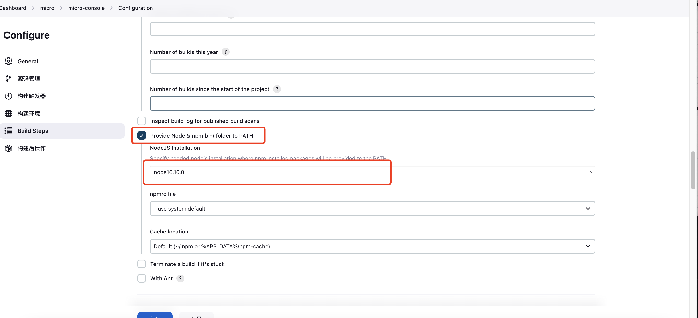

# jenkins基础配置
## 一、配置主应用console

## 二、配置子应用app
步骤同一。
- 需要修改git地址
- 最后一步复制: 根目录/jenkins-shell/app.sh

## 三、配置gunboss页面
步骤同一。
- 需要修改git地址
- 最后一步复制: 根目录/jenkins-shell/gunboss.sh
  
## 四、配置后端api服务
步骤同一。
- 需要修改git地址
- 最后一步复制: 根目录/jenkins-shell/home-api.sh

## 五、配置网关
步骤同一。
- 复制: 根目录/jenkins-shell/gateway.sh

## 六、建立一个数据库 qiankun
需要手动在mysql中建立数据库qiankun，后续建表将由后端服务自动创建。
